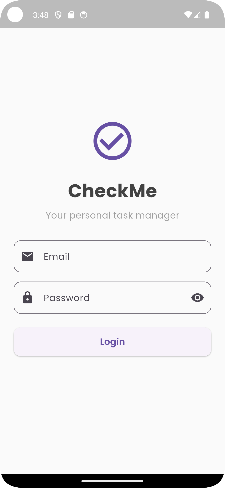
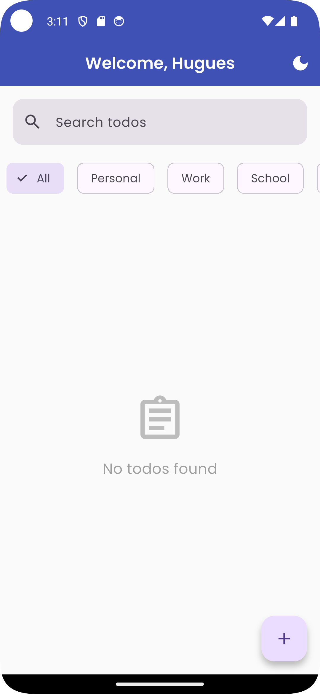
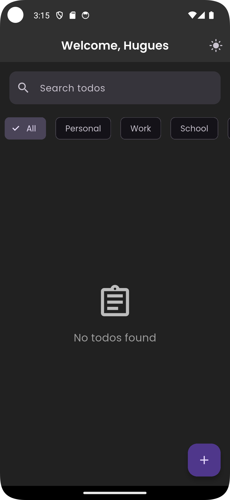
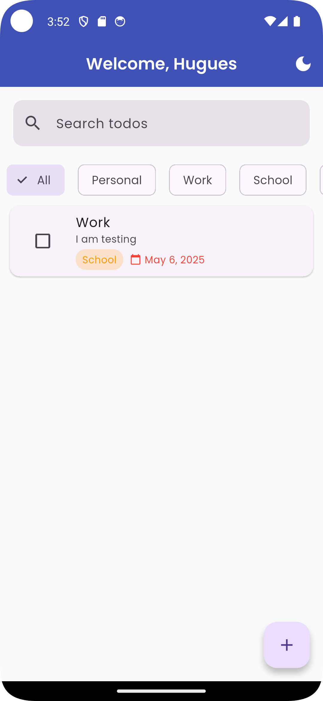
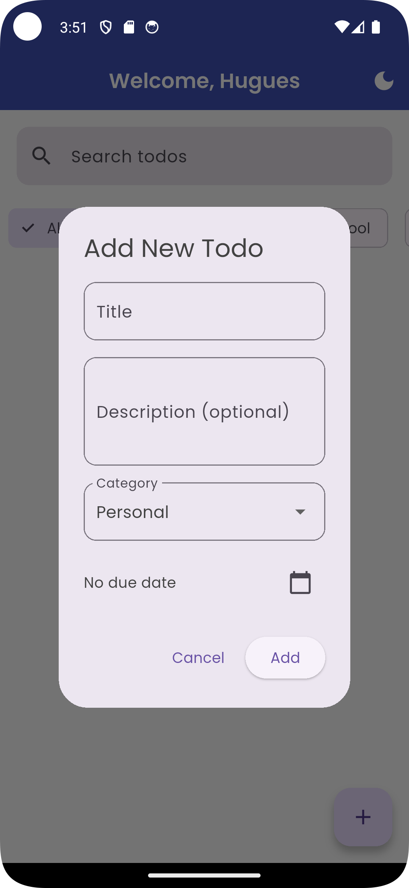
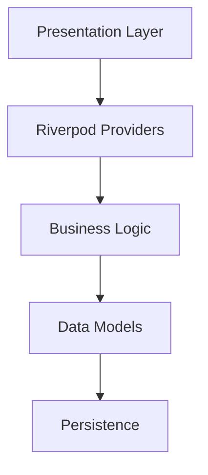

# CheckMe - Professional Todo Application

A production-grade todo application built with Flutter, featuring robust state management with Riverpod and adaptive theme switching.

## 📱 Application Preview

<div align="center">
  
   
  
  
  
</div>

> Screenshots directory: `D:\Desktop\AUCA\MOBILE PROGRAMMING\FlutterApps\screenshots`

## 🚀 Key Features

| Feature                | Implementation Details |
|------------------------|-----------------------|
| **Secure Authentication** | Email validation with regex pattern matching |
| **Todo Management**    | CRUD operations with Riverpod state management |
| **Smart Organization** | Categories (Personal/Work/School/Urgent) with color coding |
| **Time Awareness**     | Due dates with overdue visual indicators |
| **Instant Search**     | Real-time search through todos |
| **Adaptive Theming**   | Light/Dark/System theme modes |

## 📦 Technical Architecture



## ⚙️ System Requirements

- Flutter SDK 3.0+
- Android 8.0+ (API 26) or iOS 13+
- Dart 3.0+

## 📥 Installation Options

### Option 1: Direct APK Download
[](https://github.com/Hugues6221394/Mobile-Programming-Flutter/releases/download/v1.0.0/CheckMe-Todo.apk)

Scan to install:  


### Option 2: Build from Source
# Clone repository
git clone https://github.com/Hugues6221394/Mobile-Programming-Flutter.git

# Install dependencies
flutter pub get

# Run in debug mode
flutter run

# Build release APK
flutter build apk --release


## 🏗 Project Structure

```
lib/
├── models/
│   ├── todo/ 
├── providers/
│   ├── todo_provider/          
├── screens/
│   ├── edit_todo_screen/
│   ├── home_screen/
│   ├── login_screen/
│   ├── todo_details_screen/
├── theme/
│   ├── app_theme/     
└── main.dart          
```

## 📚 Documentation

- [State Management Diagram](screenshots/state_management.png)
- [Theme System Documentation](screenshots/theme_system.png)
- [API Reference](#) <!-- Add link if applicable -->

## 🛠 Troubleshooting

| Issue | Solution |
|-------|----------|
| APK won't install | Enable "Install Unknown Sources" in Android settings |
| Build failures | Run `flutter clean` then `flutter pub get` |
| Theme not changing | Verify Riverpod provider scope |

## 📜 License

MIT License - See [LICENSE](LICENSE) for details.

## 📬 Contact

For support or feature requests:  
[Create an Issue](https://github.com/Hugues6221394/Mobile-Programming-Flutter/issues)  
Email: [docworld74@gmail.com](mailto:docwrold74@gmail.com)
